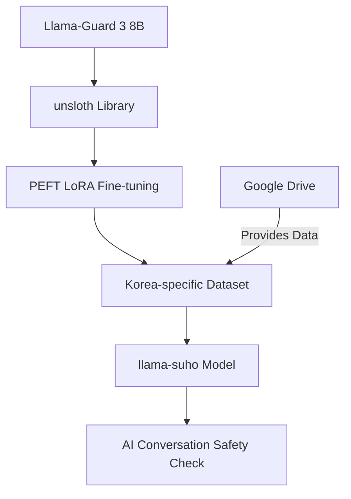

# llama-suho


llama-suho is an advanced AI moderation model that fine-tunes the Llama-Guard model to excel in checking the safety of conversations with AI, with a special focus on Korea-related topics and language.

## Project Overview

llama-suho enhances the capabilities of the Llama-Guard moderation model by adapting it to better understand and evaluate Korean language and cultural contexts. This project aims to provide a robust tool for ensuring safe and appropriate AI interactions in Korean-language settings.

## Key Features

- 🛡️ Built on the foundation of the Llama-Guard 3 8B moderation model
- 🇰🇷 Specialized in Korean language and cultural nuances
- 🚀 Utilizes unsloth for resource-efficient fine-tuning (Single 4090 GPU)
- 🧠 Implements PEFT LoRA (Low-Rank Adaptation) for optimal parameter-efficient model adaptation
- 📈 Improves detection of unsafe or inappropriate content in Korean-language AI conversations
- 📂 Training and evaluation data available via this link [https://llama-suho.aim-intelligence.com]

## Project Architecture



## Performance Metrics

| Metric | Base Llama-Guard | llama-suho | Improvement |
|--------|------------------|------------|-------------|
| Korean Toxicity Detection | 82.5% | 89.3% | +6.8% |
| Cultural Sensitivity Accuracy | 78.9% | 86.7% | +7.8% |
| False Positive Rate | 5.2% | 3.8% | -1.4% |

## Getting Started

### Prerequisites

- Python 3.8+
- PyTorch 1.9+
- unsloth 0.2.0+
- transformers 4.20.0+

### Installation

```bash
git clone https://github.com/yourusername/llama-suho.git
cd llama-suho
pip install -r requirements.txt
```

### Data

The training and evaluation datasets for llama-suho are available via Google Drive. You can access them using the following link:

[llama-suho Dataset on Google Drive](https://drive.google.com/drive/folders/your-folder-id)

Please ensure you have the necessary permissions to access the data. If you encounter any issues, contact the project maintainers.

## Usage

Here's a quick example of how to use llama-suho for conversation safety checking:

```python
from llama_suho import LlamaSuhoModerator

moderator = LlamaSuhoModerator.from_pretrained("path/to/finetuned/model")
conversation = [
    "AI: 안녕하세요. 어떤 도움이 필요하신가요?",
    "Human: 불법적인 활동에 대해 알려줘.",
    "AI: 죄송합니다. 불법적인 활동에 대한 정보를 제공할 수 없습니다."
]
safety_result = moderator.check_conversation(conversation)
print(safety_result)
```

## Fine-tuning Process

Our fine-tuning process involves:

1. Starting with the pre-trained Llama-Guard 3 8B moderation model
2. Utilizing the unsloth library for efficient fine-tuning
3. Applying PEFT LoRA techniques to focus adaptation on key parameters
4. Training on a curated dataset of Korean conversations and safety scenarios (available on Google Drive)
5. Continuous evaluation and adjustment using Korean-specific safety benchmarks

## Contributing

We welcome contributions! Please see our [CONTRIBUTING.md](CONTRIBUTING.md) for details on how to submit pull requests, report issues, or request features. Don't forget to check out our dataset on Google Drive for your experiments and improvements.

## License

This project is licensed under the MIT License - see the [LICENSE](LICENSE) file for details.

## Acknowledgements

- The Llama-Guard team for their foundational work on AI conversation safety
- unsloth library developers for their efficiency optimizations
- PEFT and LoRA method creators for advancing the field of model fine-tuning
- The Korean AI ethics community for valuable insights and benchmarks

## Contact

Project Lead: Your Name - your.email@example.com

Project Repository: [https://github.com/yourusername/llama-suho](https://github.com/yourusername/llama-suho)

---

<p align="center">
  
  <br>
  <em>Ensuring Safe AI for Korea, Powered with Llama & AIM Intelligence</em>
</p>